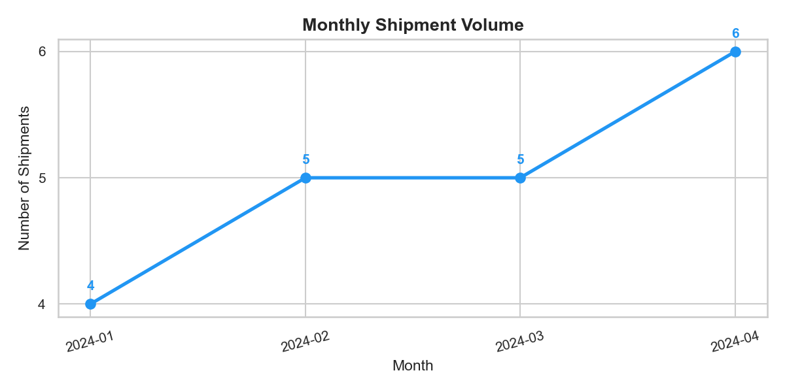
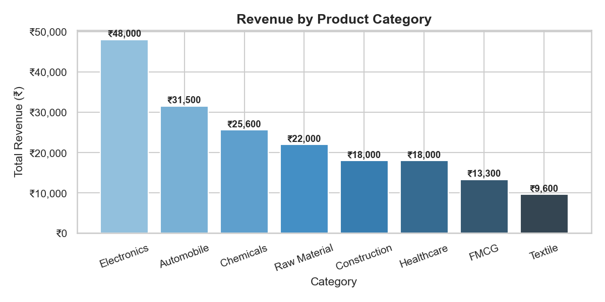
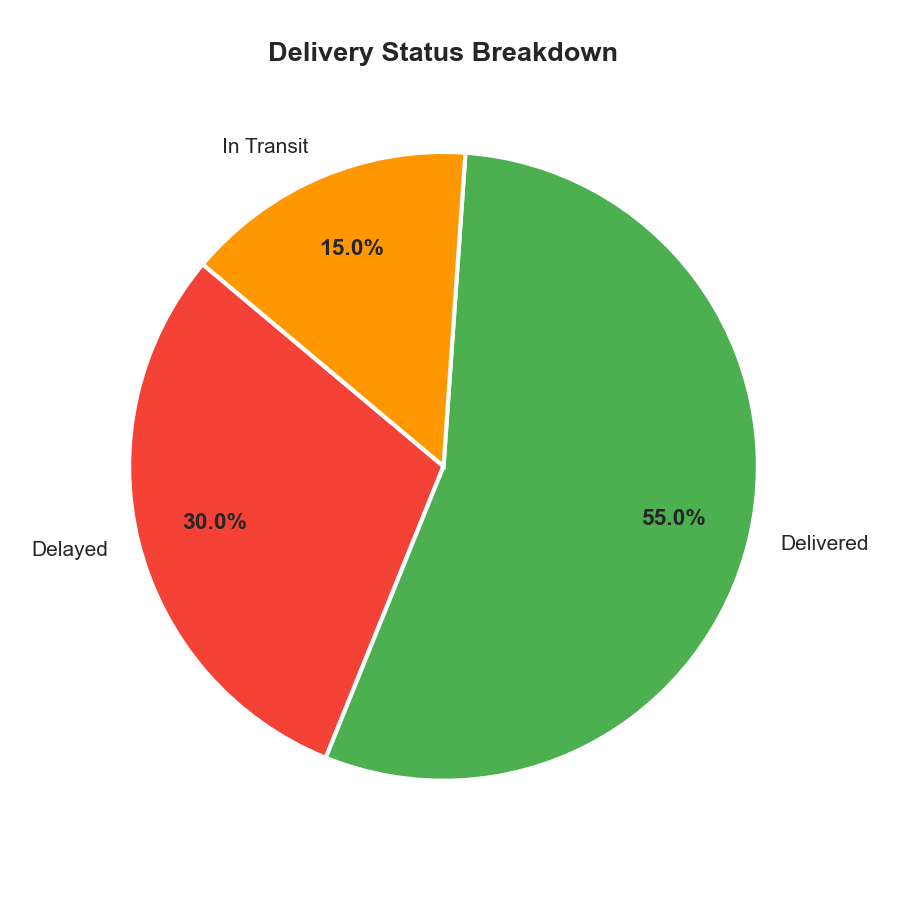
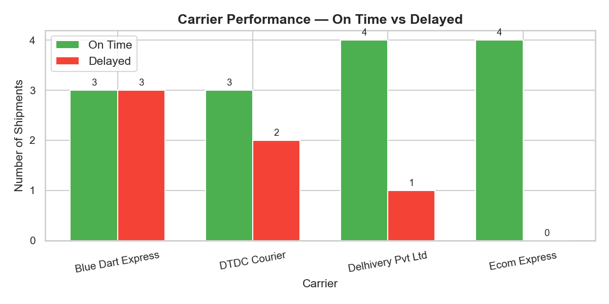
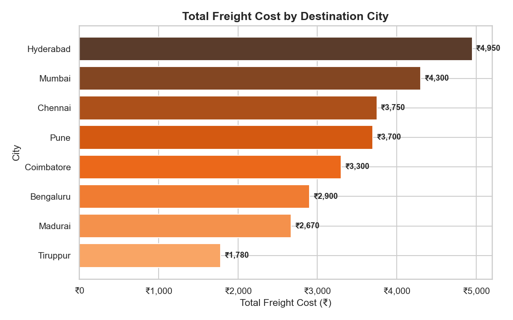

# logistics-shipment-analytics
End-to-end logistics data analytics project using MySQL, Python, and Power BI

# Logistics Shipment Performance Analytics

An end-to-end data analytics project analyzing shipment performance 
across Indian cities using MySQL, Python, and Power BI.

---

## Project Overview

| Item | Details |
|---|---|
| Domain | Logistics & Supply Chain |
| Tools Used | MySQL, Python, Pandas, Matplotlib, Seaborn, Power BI |
| Dataset | 20 shipments across 8 Indian cities (self-created) |
| Duration | Jan 2024 – Apr 2024 |

---

## Business Questions Answered

- Which carrier has the highest delay rate?
- Which product category generates the most revenue?
- Which cities have the highest freight costs?
- Is monthly shipment volume growing?
- What percentage of shipments are delivered on time?

---

## Project Structure
logistics_project/
├── charts/          # Matplotlib & Seaborn visualizations
├── dashboard/       # Power BI .pbix file and PDF export
├── scripts/         # Python analysis scripts
└── sql/             # MySQL schema and queries

---

## Key Findings

- **On-Time Rate:** 55% of shipments delivered on time
- **Delay Rate:** 30% of shipments were delayed
- **Top Revenue Category:** Electronics (₹48,000)
- **Highest Freight Cost City:** Hyderabad (₹4,950)
- **Best Performing Carrier:** Ecom Express (0% delay rate)
- **Worst Performing Carrier:** DTDC Courier (40% delay rate)

---

## Dashboard Preview

### Overview Page

### Revenue by Category

### Delivery Status

### Carrier Performance

### Freight by City

---

## Tools & Technologies

| Tool | Purpose |
|---|---|
| MySQL | Database design, schema, queries |
| Python (Pandas, NumPy) | Data cleaning and analysis |
| Matplotlib & Seaborn | Data visualization |
| Power BI | Interactive dashboard |
| VS Code | Development environment |

---

## How to Run This Project

1. Import SQL schema from `sql/` folder into MySQL
2. Run `scripts/logistics_analysis.py` to analyse data
3. Run `scripts/visualizations.py` to generate charts
4. Open `dashboard/logistics_dashboard.pbix` in Power BI Desktop
